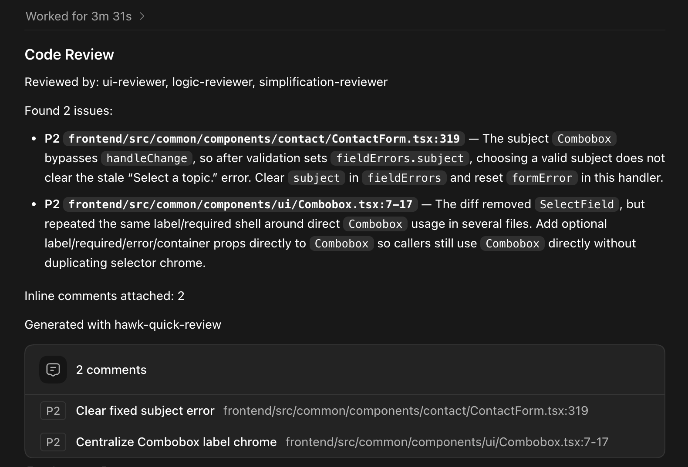
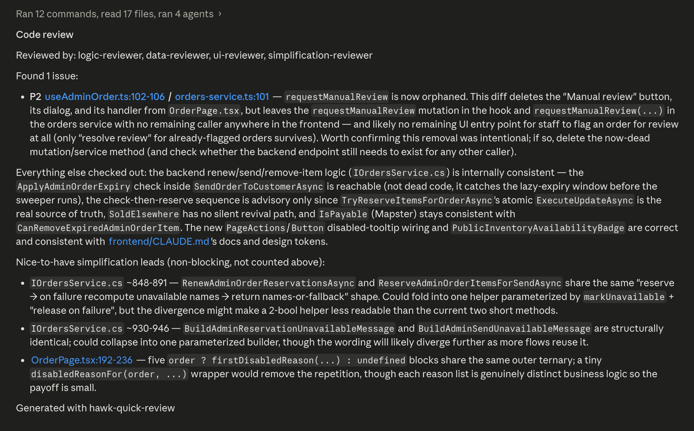

# hawk-skills

Personal AI CLI skills — reusable across Claude Code and Codex CLI.

This repository packages repeatable AI-assisted engineering workflows as
versioned skills for Claude Code and Codex. It covers feature work, existing
project review, local change review, review remediation, project-aware UI
implementation, installation, and skill updates.

## Why this exists

AI coding tools are more useful when repeatable workflows are explicit,
portable, and easy to keep current. This repo keeps those workflows versioned in
one place and installs them into both Claude Code and Codex.

## Project highlights

- Cross-CLI skill packaging for Claude Code and Codex.
- macOS/Linux and native Windows PowerShell installers.
- Versioned, inspectable workflows that can evolve with a project.
- In-agent updates that refresh installed skill links after repository changes.

## Engineering focus

The repo is intentionally small, but it demonstrates how I approach developer
tooling: make common workflows repeatable, keep automation inspectable, support
multiple environments, and keep a human review point over consequential decisions.

## Install

Clone the repo and run the installer for your OS.

macOS/Linux:

```bash
git clone https://github.com/olwg199/hawk-skills.git ~/hawk-skills
~/hawk-skills/install.sh
```

Windows PowerShell:

```powershell
git clone https://github.com/olwg199/hawk-skills.git "$HOME\hawk-skills"
powershell -ExecutionPolicy Bypass -File "$HOME\hawk-skills\install.ps1"
```

The Windows installer is native PowerShell; it does not require Bash, Git Bash,
or WSL.

By default, this installs the skills for both Claude Code and Codex. To install
for only one CLI:

```bash
~/hawk-skills/install.sh --claude    # Claude Code only
~/hawk-skills/install.sh --codex     # Codex CLI only
```

```powershell
powershell -ExecutionPolicy Bypass -File "$HOME\hawk-skills\install.ps1" -Claude    # Claude Code only
powershell -ExecutionPolicy Bypass -File "$HOME\hawk-skills\install.ps1" -Codex     # Codex CLI only
```

For Claude Code, the installer links each skill into `~/.claude/skills/`.
Current Claude Code exposes those skills to both Claude and you: Claude can load
them automatically when relevant, and you can invoke them directly as slash
commands such as `/hawk-quick-review`.

The installer does not create `~/.claude/commands/*.md` mirrors by default.
Those mirrors are only for older Claude Code versions and can make current
Claude Code list the same skill twice. To opt into legacy command mirrors:

```powershell
powershell -ExecutionPolicy Bypass -File "$HOME\hawk-skills\install.ps1" -ClaudeCommands
```

```bash
~/hawk-skills/install.sh --claude-commands
```

## Update your skills

After installing, use this command whenever you want the latest skills:

```text
/hawk-skills-update
```

The update skill checks GitHub for changes and refreshes the Claude Code and
Codex links, so added, renamed, and deleted skills stay in sync without
rerunning the installer. Restart or reload your CLI afterward so it picks up
the changed instructions.

## Skills

All personal skills in this repo use the `hawk-` prefix for folder names,
`name:` frontmatter, and slash commands to avoid collisions with community or
built-in skill names.

Use the skills in the order that matches your development workflow:

1. [`hawk-build`](#hawk-build) — plan and carry out a feature, fix, refactor, or investigation.
2. [`hawk-mobile-ui-builder`](#hawk-mobile-ui-builder) — build reusable mobile UI from screenshots.
3. [`hawk-project-review`](#hawk-project-review) — understand and assess an existing project area.
4. [`hawk-quick-review`](#hawk-quick-review) — review completed local changes with focused specialists.
5. [`hawk-fix-review-findings`](#hawk-fix-review-findings) — address findings from that review.

## Skill details

### `hawk-build`

Run a durable build lifecycle for features, fixes, refactors, and technical
investigations. It creates one tracked Markdown record per build in `.build/`,
researches and refines the task with you, saves the confirmed plan before
implementation, and records meaningful implementation attempts, delegated work,
verification, deviations, and final results.

It also maintains concise reusable project research in `.codex/hawk-build.md`.
Future builds verify and reuse its architecture, placement, dependency, naming,
and verification conventions while keeping task-specific history in each build
record. Build plans follow the nearest comparable maintained feature and favor
clear responsibility-based helpers, validators, repositories, services, and UI
components in the project's established locations.

For hand-written source, roughly 500 lines is a cohesion-review signal rather
than a hard limit. Large UI components are normally decomposed along meaningful
responsibilities, while a cohesive service or workflow may remain larger when
splitting would make it harder to follow.

When a task can be safely partitioned, it assigns non-overlapping UI, API, data,
test, or research workstreams to subagents and consolidates their compact results
in the build record. Related user-authorized commits use a `Build: <build-id>`
trailer for traceability.

**Invoke:**
- Claude Code: `/hawk-build Add account rate limiting`
- Codex: `/hawk-build Research, plan, and build account rate limiting`

### `hawk-mobile-ui-builder`

Build pure mobile UI from screenshots while reusing the target project's
component and screen structure.

**How it works:**
1. Inspects the project and reads `.codex/mobile-ui-builder.md` when present
2. Decomposes provided screenshots into screens, sections, and reusable UI components
3. Asks where existing and new components/screens should live before implementing
4. Implements only presentation UI and leaves non-UI logic as `TODO:` comments
5. Updates `.codex/mobile-ui-builder.md` with confirmed project conventions

**Invoke:**
- Claude Code: `/hawk-mobile-ui-builder`
- Codex: `/hawk-mobile-ui-builder`

### `hawk-project-review`

Review an existing feature, behavior, subsystem, file, symbol, or reported
problem without requiring a commit diff. The skill traces the relevant
implementation, explains how it currently works, identifies evidence-backed
defects and improvement opportunities, and recommends proportionate fixes.

The target comes from the request rather than the worktree diff. A target may be
a named project area such as order synchronization, an observed symptom such as
lost updates, or a source path or symbol. The review stays bounded to directly
relevant callers, data flow, contracts, tests, configuration, and error
boundaries.

Current defects receive stable `F1` IDs and priorities. Non-blocking
maintainability, reliability, performance, testability, and simplification
opportunities receive `I1` IDs. Recommendations include affected locations,
required behavior, tradeoffs, and verification. Structural recommendations are
grounded in the nearest comparable maintained project implementation when one
exists. The skill remains read-only; implementation can be handed to
`hawk-build`.

**Invoke:**
- Claude Code: `/hawk-project-review Review how order synchronization works and how it can be improved`
- Codex: `/hawk-project-review Determine why session refresh can log users out and recommend a fix`

### `hawk-quick-review`

Adaptive local code review that reads the actual change and selects the
reviewer perspectives that fit it, instead of applying the same generic
checklist to every diff. It is designed to give you a concise, actionable second
set of eyes before a commit.

It reviews uncommitted tracked changes (`git diff HEAD`) and identifies likely
intentional untracked source or configuration files. Depending on the change,
it can bring in focused UI, logic, data, security, API, or simplification
reviewers. The resulting findings are filtered for confidence, tied to precise
file and line references, and given stable IDs (`F1`, `S1`) so they are easy to
discuss or pass to `hawk-fix-review-findings`.

**How it works:**
1. Reads the diff and selects one to three relevant specialists.
2. Runs only the selected reviewers; it adds simplification review when the
   change warrants it.
3. Merges findings, filters low-confidence issues, and outputs stable `F1`
   finding IDs and `S1` simplification-lead IDs.
4. Always suggests a human-style commit message when the review reports no
   issues.

The simplification reviewer runs for explicit simplification or refactor
requests, repeated changed code, large refactors, or code that appears to
reimplement a nearby project-local helper or pattern. Plausible but unproven
ideas are reported separately as non-blocking leads.

Actual findings require an evidence-supported reachable trigger and an incorrect
observable outcome. Merely imaginable failures are not findings, and exceptions
already handled with the required outcome are not reported. Review feedback
supports clear responsibility-based file organization rather than treating file
or abstraction count as complexity by itself.

When the host supports it, the selected specialists can review in parallel;
otherwise the skill uses the same focused process sequentially. In Codex,
model selection follows Codex's normal policy. In Claude Code, it uses Haiku
for planning and filtering and Sonnet for routine specialist review; more
expensive models are reserved for explicit requests or unusually complex,
high-impact unresolved findings. The review returns in the assistant response
or terminal, depending on the host.

**Invoke:**
- Claude Code: `/hawk-quick-review`
- Codex: `/hawk-quick-review using parallel sub-agents`
- Codex with reviewer focus: `/hawk-quick-review use subagents Make sure data consistency is not compromised`

Codex output with inline review comments:



Claude Code output with specialist reviewers and simplification leads:



### `hawk-fix-review-findings`

Fix findings from the preceding `hawk-quick-review` output or from pasted local
review text. It includes reported issues and nice-to-have simplification leads
by default; stable `F1` and `S1` IDs let comments precisely prioritize, skip,
or clarify those items.

The skill starts from each reported file and line, inspecting only directly
related code and expanding context only when necessary. It does not rerun the
review or re-review the complete diff. When separate findings have exclusive
paths or subsystems, it can delegate up to three scoped fixes in parallel;
otherwise it coordinates the edits sequentially.

Fixes target the demonstrated outcome with the clearest safe implementation.
When several real failures need the same result, the skill prefers the project's
existing error boundary over separate speculative guards or recovery paths. It
may extract responsibility-based helpers, validators, repositories, services,
or UI components when that makes the repair easier to understand.

After all accepted fixes are integrated, it runs the smallest relevant existing
tests, typechecks, linters, or build commands once for the entire batch. It
reports fixed, skipped, blocked, and verification-failed findings with the
changed files and check results. It never commits, pushes, or reruns the review
automatically.

**Invoke:**
- Claude Code: `/hawk-fix-review-findings`
- Codex: `/hawk-fix-review-findings Fix the findings from the preceding review`
- With comments: `/hawk-fix-review-findings Skip F2; prioritize F1 and S1`
