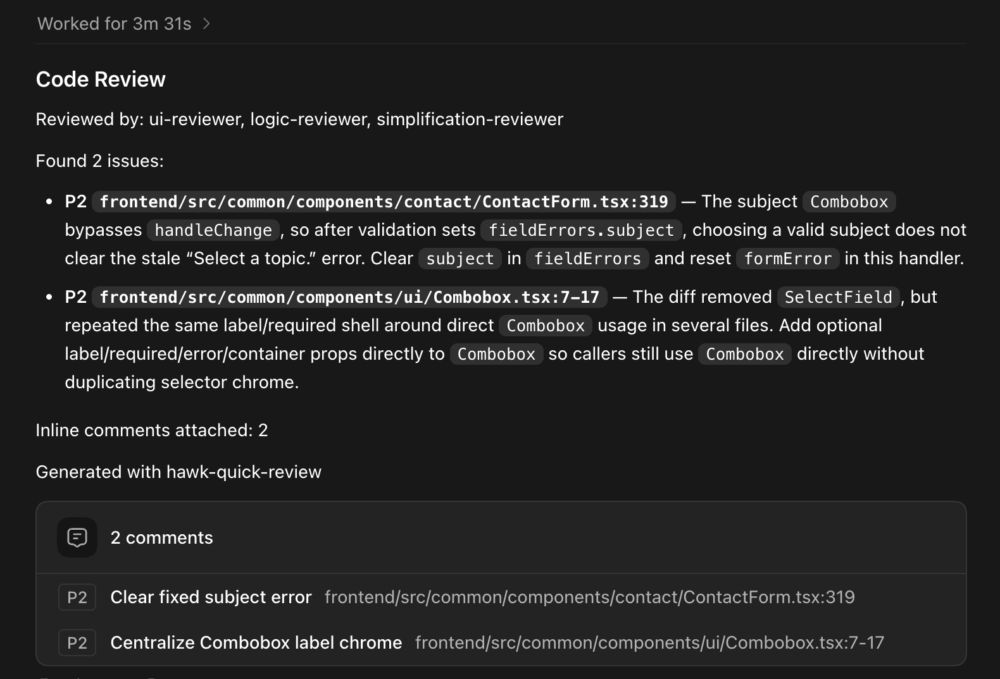
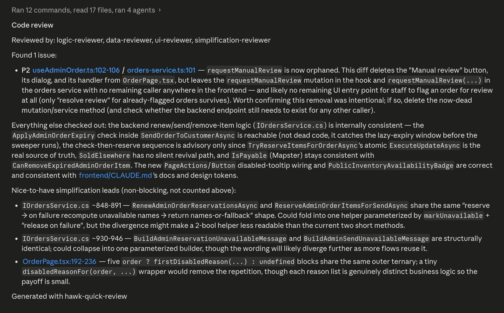

# hawk-skills

Personal AI CLI skills — reusable across Claude Code and Codex CLI.

This repository packages repeatable AI-assisted engineering workflows as
versioned skills for Claude Code and Codex. It covers feature work, existing
project review, local change review, review remediation, project-aware UI
implementation, knowledge transfer, installation, and skill updates.

## Why this exists

AI coding tools are more useful when repeatable workflows are explicit,
portable, and easy to keep current. This repo keeps those workflows versioned in
one place and installs them into both Claude Code and Codex.

## Project highlights

- Cross-CLI skill packaging for Claude Code and Codex.
- macOS/Linux and native Windows PowerShell installers.
- Versioned, inspectable workflows that can evolve with a project.
- In-agent updates that refresh installed skill links after repository changes.

## Engineering focus

The repo is intentionally small, but it demonstrates how I approach developer
tooling: make common workflows repeatable, keep automation inspectable, support
multiple environments, and keep a human review point over consequential decisions.

## Install

Clone the repo and run the installer for your OS.

macOS/Linux:

```bash
git clone https://github.com/olwg199/hawk-skills.git ~/hawk-skills
~/hawk-skills/install.sh
```

Windows PowerShell:

```powershell
git clone https://github.com/olwg199/hawk-skills.git "$HOME\hawk-skills"
powershell -ExecutionPolicy Bypass -File "$HOME\hawk-skills\install.ps1"
```

The Windows installer is native PowerShell; it does not require Bash, Git Bash,
or WSL.

By default, this installs the skills for both Claude Code and Codex. To install
for only one CLI:

```bash
~/hawk-skills/install.sh --claude    # Claude Code only
~/hawk-skills/install.sh --codex     # Codex CLI only
```

```powershell
powershell -ExecutionPolicy Bypass -File "$HOME\hawk-skills\install.ps1" -Claude    # Claude Code only
powershell -ExecutionPolicy Bypass -File "$HOME\hawk-skills\install.ps1" -Codex     # Codex CLI only
```

For Claude Code, the installer links each skill into `~/.claude/skills/`.
Current Claude Code exposes those skills to both Claude and you: Claude can load
them automatically when relevant, and you can invoke them directly as slash
commands such as `/hawk-quick-review`.

For Codex, this repository's installer links skills into `~/.codex/skills/`.
Invoke a skill with `$skill-name`, for example `$hawk-quick-review`. Start or
reload your agent session after installation so newly added skills are available.

The installer does not create `~/.claude/commands/*.md` mirrors by default.
Those mirrors are only for older Claude Code versions and can make current
Claude Code list the same skill twice. To opt into legacy command mirrors:

```powershell
powershell -ExecutionPolicy Bypass -File "$HOME\hawk-skills\install.ps1" -ClaudeCommands
```

```bash
~/hawk-skills/install.sh --all --claude-commands
```

## Update your skills

After installing, fetch the latest published skills from `origin/main`:

```text
Claude Code: /hawk-skills-update
Codex: $hawk-skills-update
```

The update skill checks GitHub for changes and refreshes the Claude Code and
Codex links, so added, renamed, and deleted skills stay in sync without
rerunning the installer. Restart or reload your CLI afterward so it picks up
the changed instructions.

Default updates require this repository's `main` branch and never switch branches
for you. To activate local edits or newly added skills from your current checkout,
use local mode:

```text
Claude Code: /hawk-skills-update --local
Codex: $hawk-skills-update --local
```

Local mode refreshes installed links without fetching, pulling, or switching
branches. You can also rerun the installer for your OS. Start or reload the agent
session afterward.

## Project documentation

Human documentation lives under `docs/`; skill working records live under
`docs/generated/<skill>/` with their existing contents and formats. Writing
skills create missing folders and the generated-folder notice when needed.
These are paths in the project you are working on, not a central store in the
installed skills folder. Thin `CLAUDE.md` imports `AGENTS.md`, which routes agents
to specific maintained rule files under `docs/`. Codex reads `AGENTS.md` directly;
`CODEX.md` is optional and its absence never blocks review.
See [documentation navigation](docs/README.md) and
[working with both coding agents](docs/working-with-agents.md).

## Skills

All personal skills in this repo use the `hawk-` prefix for folder names,
`name:` frontmatter, and slash commands to avoid collisions with community or
built-in skill names.

The catalog follows development lifecycle order. Choose the skill for the work
you need; these are not mandatory sequential stages:

1. [`hawk-build`](#hawk-build) — plan and carry out a feature, fix, refactor, or investigation.
2. [`hawk-mobile-ui-builder`](#hawk-mobile-ui-builder) — build reusable mobile UI from screenshots.
3. [`hawk-knowledge-transfer`](#hawk-knowledge-transfer) — organize human docs and shared agent instructions.
4. [`hawk-project-review`](#hawk-project-review) — understand and assess an existing project area.
5. [`hawk-quick-review`](#hawk-quick-review) — review completed local changes with focused specialists.
6. [`hawk-fix-review-findings`](#hawk-fix-review-findings) — address supplied review findings.

## Skill details

### `hawk-build`

Run a durable build lifecycle for features, fixes, refactors, and technical
investigations. Clear, localized tasks use the lightweight path: make the
authorized change, verify it, and save one compact entry in
`docs/generated/hawk-build/builds/index.md`. They do not require a full plan or
another approval for work you already authorized.

More complex or uncertain tasks use the full lifecycle. It researches and
refines the task with you, saves the confirmed plan before implementation, and
keeps a separate Markdown record under `docs/generated/hawk-build/builds/` for
milestones, delegated work, verification, deviations, and final results.
Research stops once scope, approach,
and verification are supported; additional exploration follows unresolved
dependencies or concrete risks. Resumed builds read current state first and
consult history only when needed. Detailed skill references load at the relevant
stage, and tool results stay focused on useful evidence.

It also maintains concise reusable project research in `docs/generated/hawk-build/project.md`.
The map targets at most 500 words, linking existing documentation for detail.
Future builds verify and reuse its architecture, placement, dependency, naming,
and verification conventions while keeping task-specific history in each build
record. Build plans follow the nearest comparable maintained feature and favor
clear responsibility-based helpers, validators, repositories, services, and UI
components in the project's established locations.

For full builds, before implementation the record presents a compact plan that separates what
is needed, what has been decided, boundaries, acceptance checks, and named work
items. Each work item owns its status, missing details or decision when needed,
work, paths, and verification, so questions and approval scope are not repeated
in separate lists. The user can approve, revise, or exclude items by ID. By
default, implementation waits while any item needs details, a decision, or
approval; the user may explicitly authorize staged execution of independent
approved items.

Hawk Build may inspect and run existing tests, but it does not plan or change
tests or test-owned artifacts unless the user directly asked for that test
change in the task. Build or plan approval alone does not add test work. If a test
fails, Hawk Build fixes an in-scope production regression when supported;
otherwise it reports the failure and options without rewriting the test.

At completion, the checkpoint lists only remaining local code-readiness actions.
Any manual readiness prerequisite includes its timing and expected result. A
separate review may be suggested when useful, but Hawk Build does not depend on
another skill to finish. Commit, push, deployment, release, and post-deployment
actions are not completion prerequisites and never happen automatically.
Related commits can be prepared when you explicitly authorize them.

For hand-written source, roughly 500 lines is a cohesion-review signal rather
than a hard limit. Large UI components are normally decomposed along meaningful
responsibilities, while a cohesive service or workflow may remain larger when
splitting would make it harder to follow.

When a task can be safely partitioned, it assigns non-overlapping UI, API, data,
or research workstreams to subagents using focused task packets and fresh
context when supported, then consolidates their compact results in the build
record. Related user-authorized commits use a `Build: <build-id>`
trailer for traceability.

**Invoke:**
- Claude Code: `/hawk-build Add account rate limiting`
- Codex: `$hawk-build Research, plan, and build account rate limiting`

### `hawk-mobile-ui-builder`

Build pure mobile UI from screenshots while reusing the target project's
component and screen structure. Scope additional presentation states to the
requested component or screen and evidence from the request or existing code.
Actions expose callbacks without expanding into destination screens or workflows.

**How it works:**
1. Inspects the project and reads `docs/generated/hawk-mobile-ui-builder/project.md` when present
2. Decomposes provided screenshots into screens, sections, reusable UI components, and relevant UI states
3. Resolves placement and reuse from project conventions, asking only about material ambiguity or new conventions
4. Implements renderable states with props, callbacks, and deterministic preview fixtures where useful; leaves non-UI integration as `TODO:` comments
5. Updates `docs/generated/hawk-mobile-ui-builder/project.md` with confirmed project conventions
6. Verifies the reference and additional states, then reports the props and callbacks to wire during functionality work

**Invoke:**
- Claude Code: `/hawk-mobile-ui-builder`
- Codex: `$hawk-mobile-ui-builder`

### `hawk-knowledge-transfer`

Organize a requested project area into concise human documentation under `docs/`,
using current code and existing records as evidence. Preserve manual prose and
working-record content. Maintain a thin `CLAUDE.md` pointer,
an `AGENTS.md` docs routing index, and the actual rules in maintained docs.
Inspect `CODEX.md` only if it exists; do not create or require it. Keep
a current Knowledge and Codex/Claude compatibility section in the
working-with-agents documentation. Follow established docs structure and verify
links, instructions, commands, and host-specific loading behavior.

Name the area to document, or explicitly request the whole project for onboarding
documentation. The skill updates docs and instructions; it does not change
production code, commit changes, or run a separate review automatically.

**Invoke:**
- Claude Code: `/hawk-knowledge-transfer Document order synchronization and its agent handoff`
- Codex: `$hawk-knowledge-transfer Document order synchronization and its agent handoff`

### `hawk-project-review`

Review an existing feature, behavior, subsystem, file, symbol, or reported
problem without requiring a commit diff. The skill traces the relevant
implementation, explains how it currently works, identifies evidence-backed
defects and improvement opportunities, and recommends proportionate fixes.

The target comes from the request rather than the worktree diff. A target may be
a named project area such as order synchronization, an observed symptom such as
lost updates, or a source path or symbol. The review stays bounded to directly
relevant callers, data flow, contracts, tests, configuration, and error
boundaries.

Current defects receive stable `F1` IDs and priorities. Non-blocking
maintainability, reliability, performance, testability, and simplification
opportunities receive `I1` IDs. Recommendations include affected locations,
required behavior, tradeoffs, and verification. Structural recommendations are
grounded in the nearest comparable maintained project implementation when one
exists. The skill remains read-only; implementation can be handed to
`hawk-build`.

**Invoke:**
- Claude Code: `/hawk-project-review Review how order synchronization works and how it can be improved`
- Codex: `$hawk-project-review Determine why session refresh can log users out and recommend a fix`

### `hawk-quick-review`

Adaptive local code review that reads the actual change and selects the
reviewer perspectives that fit it, instead of applying the same generic
checklist to every diff. It is designed to give you a concise, actionable second
set of eyes before a commit, including a commit-message suggestion and a small
set of optional test suggestions for critical changed behavior.

It reviews uncommitted tracked changes (`git diff HEAD`) and identifies likely
intentional untracked source or configuration files. Depending on the change,
it can bring in focused UI, logic, data, security, API, or simplification
reviewers. The resulting findings are filtered for confidence, tied to precise
file and line references, and given stable `F1` and `S1` IDs. Test suggestions
are a separate advisory section and carry no implementation state.

**How it works:**
1. Reads the diff and selects one to three relevant specialists when changes
   warrant them; an empty diff needs no code specialists.
2. Runs only the selected reviewers; it adds simplification review when the
   change warrants it.
3. Merges findings, filters low-confidence issues, and outputs stable `F1`
   finding IDs, `S1` simplification-lead IDs, and up to three scored,
   non-blocking test suggestions for critical mappings, contracts, state
   transitions, and similarly consequential behavior.
4. Always checks knowledge and Codex/Claude compatibility, including with an
   empty diff. Concrete defects block readiness; a missing optional `CODEX.md`
   does not.
5. Always suggests a human-style commit message for a non-empty reviewed change,
   even when findings or test suggestions are present.

The simplification reviewer runs for explicit simplification or refactor
requests, repeated changed code, large refactors, or code that appears to
reimplement a nearby project-local helper or pattern. Plausible but unproven
ideas are reported separately as non-blocking leads.

Test suggestions are non-blocking and never affect the ready-to-commit
conclusion. Each suggestion names the behavior to protect, why it matters,
nearby-coverage evidence, and a confidence score. Minor and duplicate ideas are
filtered out, and the review never writes or modifies tests. Suggestions are
advice only; implementing one is separate work that requires a direct request.

Actual findings require an evidence-supported reachable trigger and an incorrect
observable outcome. Merely imaginable failures are not findings, and exceptions
already handled with the required outcome are not reported. Review feedback
supports clear responsibility-based file organization rather than treating file
or abstraction count as complexity by itself.

When the host supports it, the selected specialists can review in parallel;
otherwise the skill uses the same focused process sequentially. In Codex,
model selection follows Codex's normal policy. In Claude Code, it uses Haiku
for planning and filtering and Sonnet for routine specialist review; more
expensive models are reserved for explicit requests or unusually complex,
high-impact unresolved findings. The review returns in the assistant response
or terminal, depending on the host. Every run includes Knowledge and
Codex/Claude compatibility, even with an empty code diff. Demonstrated knowledge,
instruction, or shared-tool setup defects are blocking findings; incomplete
compatibility checks also prevent readiness. Review stays read-only and leaves
repairs to Knowledge Transfer or remediation. This is a review gate, not an
installed Git hook. Both skills use the same packaged
[instruction-layout specification](docs/agent-instruction-layout.md).

**Invoke:**
- Claude Code: `/hawk-quick-review`
- Codex: `$hawk-quick-review using parallel sub-agents`
- Codex with reviewer focus: `$hawk-quick-review Make sure data consistency is not compromised`

Codex output with inline review comments:



Claude Code output with specialist reviewers and simplification leads:



### `hawk-fix-review-findings`

Fix supplied local review findings and nice-to-have simplification leads. Stable
`F1` and `S1` IDs, when present, let comments precisely prioritize, skip, or
clarify those items. Test suggestions are outside this skill's scope.

The skill starts from each reported file and line, inspecting only directly
related code and expanding context only when necessary. It does not rerun the
review or re-review the complete diff. When separate findings have exclusive
paths or subsystems, it can delegate up to three scoped fixes in parallel;
otherwise it coordinates the edits sequentially.

Fixes target the demonstrated outcome with the clearest safe implementation.
When several real failures need the same result, the skill prefers the project's
existing error boundary over separate speculative guards or recovery paths. It
may extract responsibility-based helpers, validators, repositories, services,
or UI components when that makes the repair easier to understand.

After all accepted fixes are integrated, it runs the smallest relevant existing
tests, typechecks, linters, or build commands once for the batch. It never changes
tests or test-owned artifacts. If verification still has a failing test, it
reports the command, evidence, consequence, options, and that the test was left
unchanged. It never commits, pushes, or reruns the review automatically.

**Invoke:**
- Claude Code: `/hawk-fix-review-findings`
- Codex: `$hawk-fix-review-findings Fix the findings from the preceding review`
- With comments in Codex: `$hawk-fix-review-findings Skip F2; prioritize F1 and S1`
